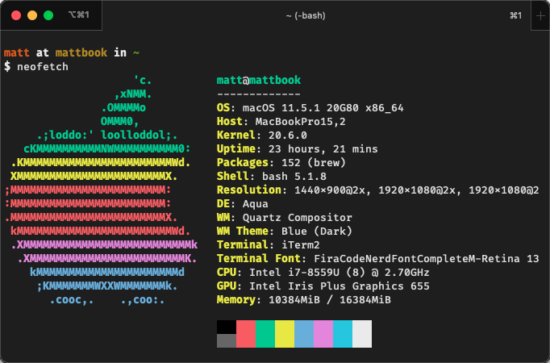

# Shihyu’s dotfiles



## Installation

```bash
git clone https://github.com/shihyuho/dotfiles.git && cd dotfiles && source bootstrap.sh
```

To update, `cd` into your local `dotfiles` repository and then:

```bash
source bootstrap.sh
```

Alternatively, to update while avoiding the confirmation prompt:

```bash
set -- -f; source bootstrap.sh
```

### Sensible macOS defaults (沒在用)

When setting up a new Mac, you may want to set some sensible macOS defaults:

```bash
./.macos
```

### Install Homebrew formulae

```bash
./brew.sh
```
